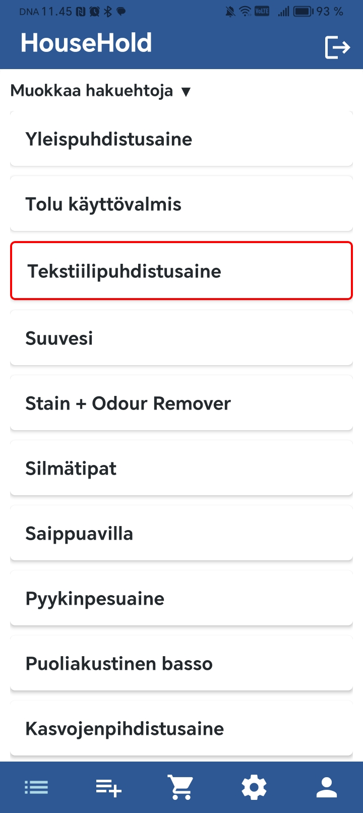
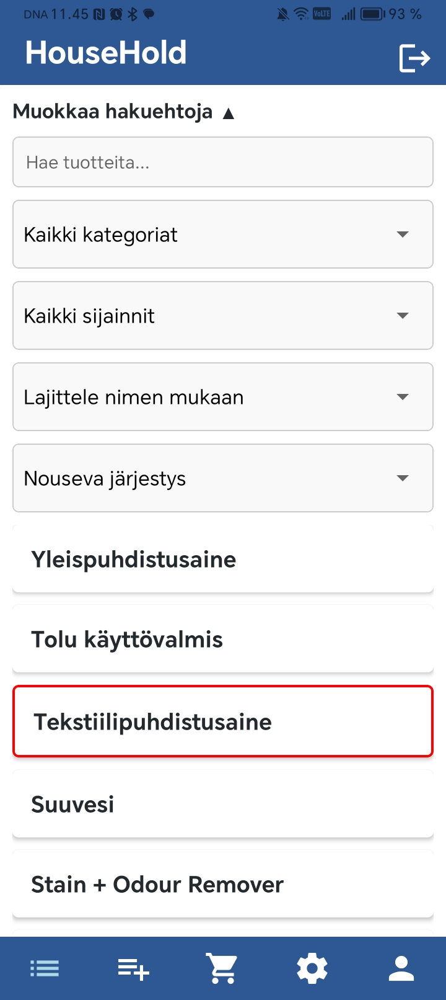
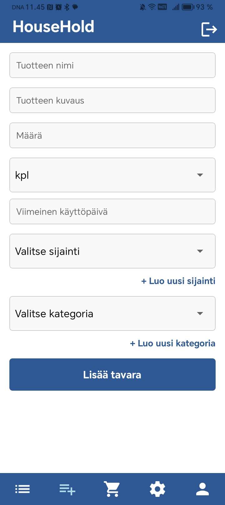
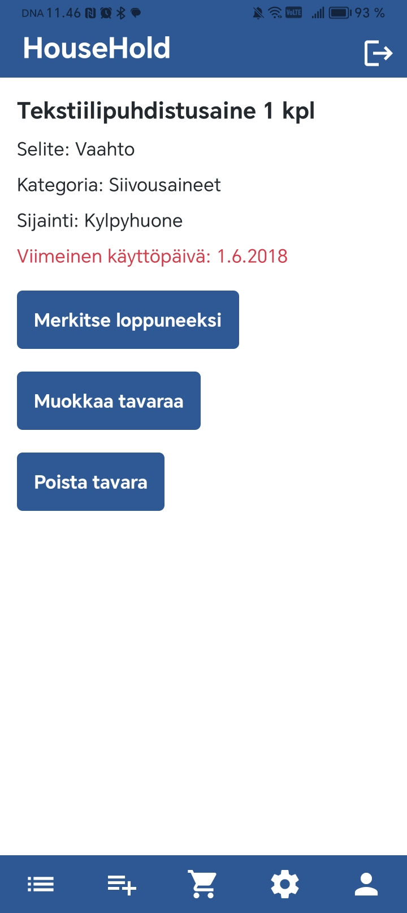
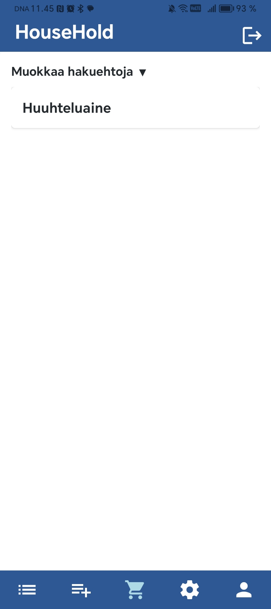
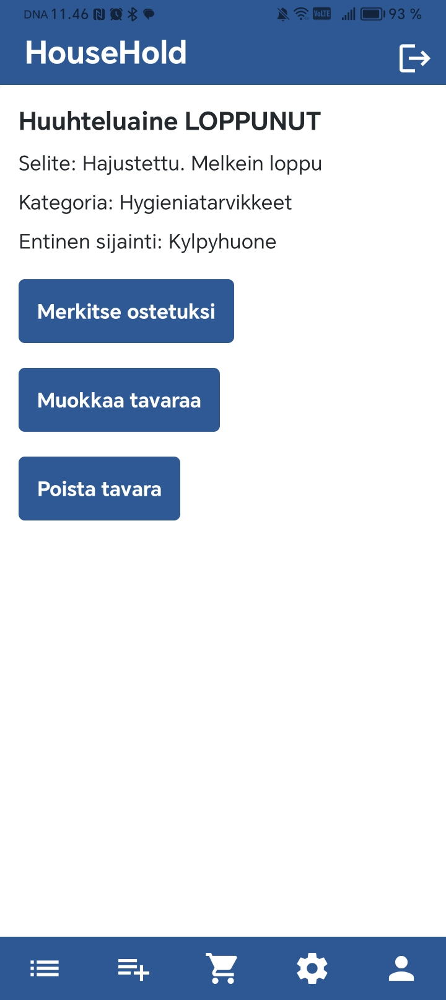
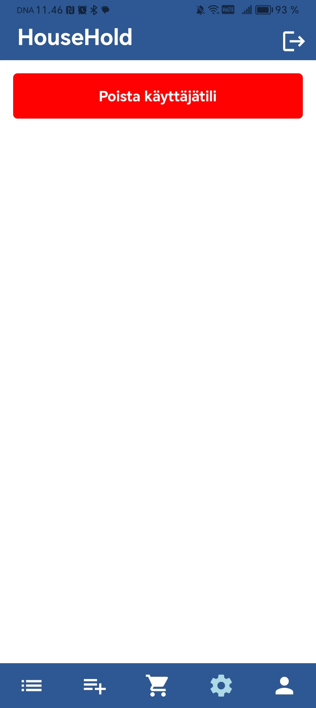
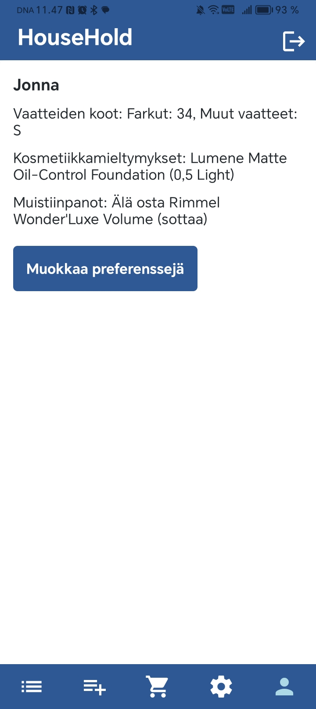

# Household App - User Guide

## Test environment

The Household application can be tested by downloading the app to your phone with the following link (only works with Android at the moment):

**[Download HouseHold App](https://expo.dev/accounts/johyy/projects/household-app/builds/ba390592-55dc-42c3-8489-ce4a3face2df)**

---

## Signing up

Create an account with your name, username and a password that has a minimum of 5 characters.

---

## Product List

Once you have logged in, the home screen will display a list of all the products in your household inventory.

You can scroll through the products and tap an producr to see its details.

---

## Filtering & Searching

To filter or search for specific items, tap on "Muokkaa hakuehtoja" (Modify search options).

Here you can search by product name, filter by category, location, or expiration date and sort the list in ascending or descending order.

---

## Adding a New Product

To add a new product, tap the plus (+) button at the bottom. 

Enter the product name and description, and set the quantity and unit.
Select a storage location and category, or create new locations and categories, that are only visible to your user. 
Optionally, you can also set an expiration date.

---

## Product Details

Tap on a product to view its details. 

Expired products are marked with red in the production list, and the expiration date is colored red at the product details view.

You can edit products details with "Muokkaa tavaraa", mark the product as finished with "Merkitse loppuneeksi", and remove the product with "Poista tavara".

---

## Missing Products list

If you select "Merkitse loppuneeksi" (Mark as finished) at the details view of the product, the product will be moved to missing products list. 

Here the search and filtering options are availabe as well. 
When you click the product you can mark it as purchased with "Merkitse ostetuksi", select the amount, and the product will go back to products list.

You can also edit products details with "Muokkaa tavaraa" and remove the product with "Poista tavara".

---

## Settings

In the settings menu, you can delete your account if needed.

Be careful, this action is irreversible.

---

## User Preferences

In user preferences view, you can customize your preferences such as clothing sizes and cosmetic preferences.

This is helpful when shopping for specific products.
